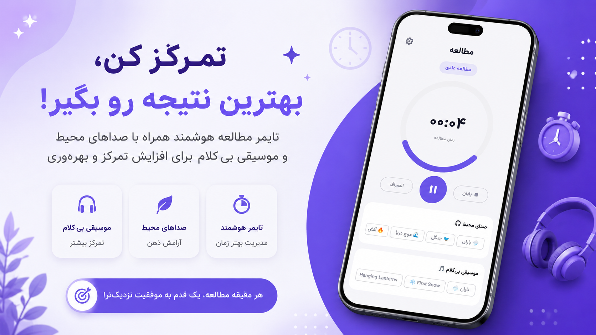
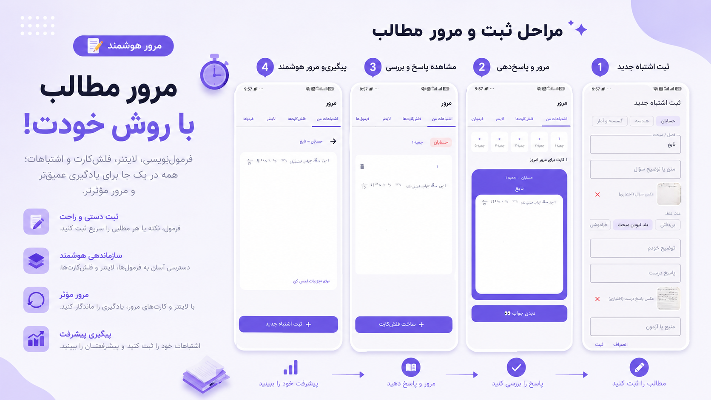
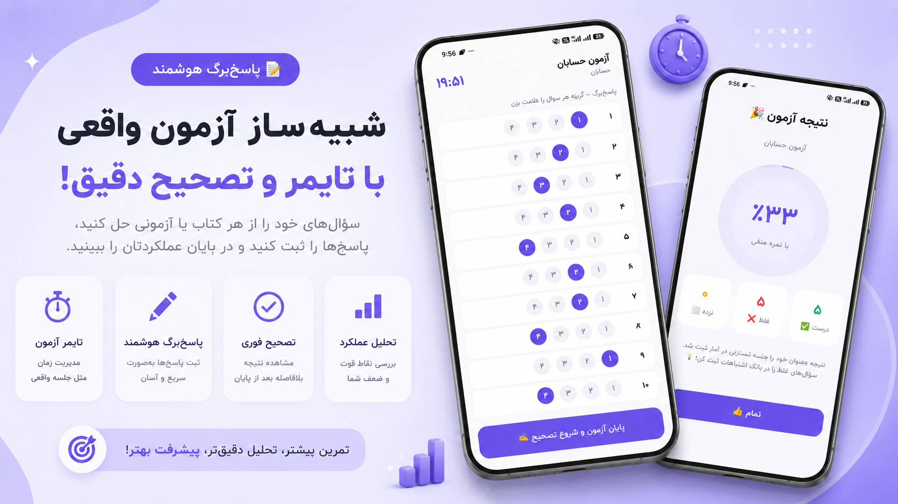
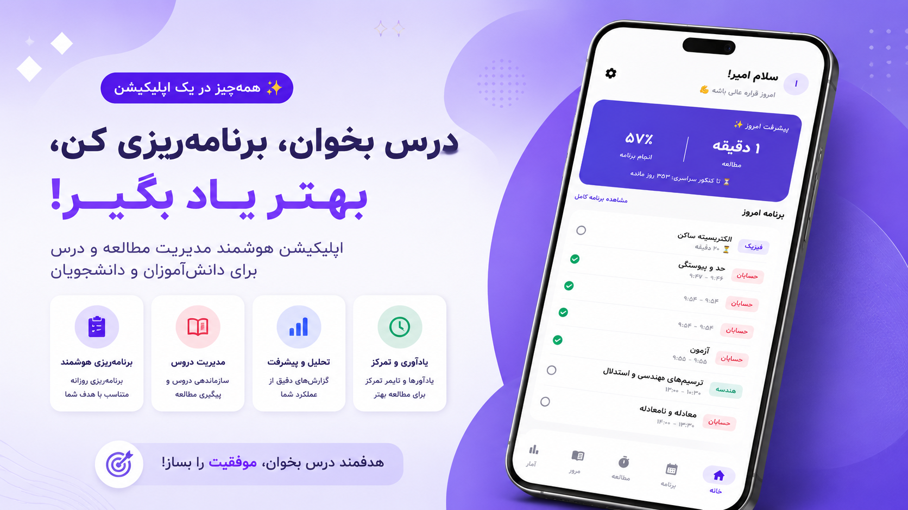
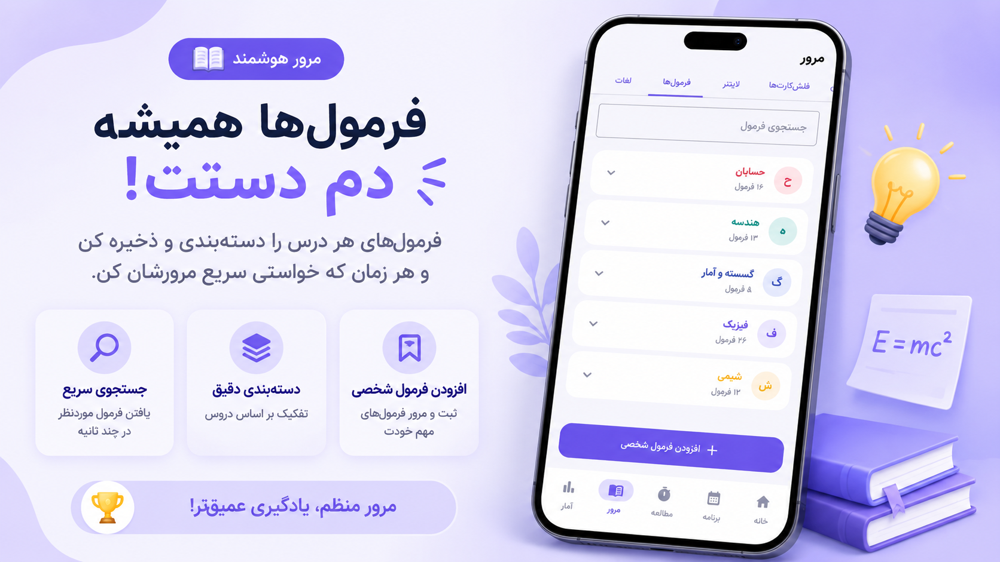
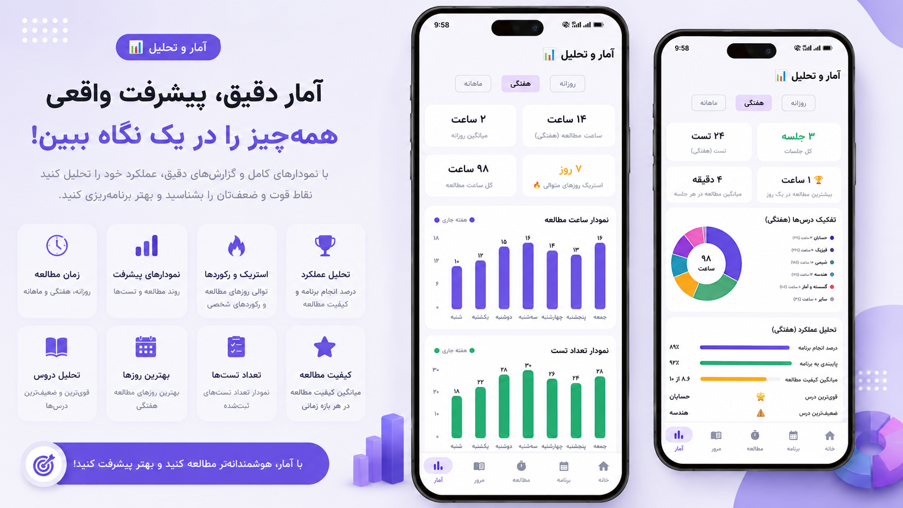

# Darsito — درسیتو

### A Konkur study companion for Android

**📥 Download on Myket → [myket.ir/app/com.konkora.app](https://myket.ir/app/com.konkora.app)**

---

## About

**Darsito** is an all-in-one study companion for students preparing for the **Konkur**,
Iran's national university-entrance exam. It brings planning, focused studying, exam
practice, and progress analytics into a single offline-first app — so a student can plan
their day, study without distraction, review their mistakes, and watch their progress
toward exam day.

> ℹ️ This is a **showcase** repository — screenshots, tech, and architecture. The source
> code is kept private because the app is a live, commercial product.

## Features

- 🗓️ **Smart study planner** — build a daily plan tailored to your goal, with a live
  countdown to the national exam and per-task progress.
- ⏱️ **Focus study timer** — timed study sessions with ambient sounds (rain, sea, forest,
  fire) and calm instrumental music to boost concentration.
- 📝 **Exam simulator** — a real answer-sheet experience with a timer, instant grading with
  negative marking, and a performance breakdown.
- 🔁 **Smart review** — a "mistake bank", flashcards, and a Leitner spaced-repetition box so
  topics come back exactly when you need them.
- 📐 **Formula bank** — save and categorize formulas by subject and pull them up in seconds.
- 📊 **Detailed analytics** — daily/weekly/monthly charts of study time and tests, streaks,
  strongest/weakest subjects, and study-quality trends.
- 🌙 **RTL / Persian UI** with a Jalali (Persian) calendar and a premium tier.

## Screenshots

<table>
<tr>
<td></td>
<td></td>
<td></td>
</tr>
<tr>
<td></td>
<td></td>
<td></td>
</tr>
</table>

## Tech & Architecture

| Area | Tech |
| --- | --- |
| **UI** | Kotlin · Jetpack Compose · Material 3 (RTL, Vazirmatn) |
| **Architecture** | MVVM — a `ViewModel` per feature (Plan, Study, Review, Exam, …) |
| **Persistence** | Room database (DAOs), fully offline-first |
| **Media** | Ambient / music players and sound effects |
| **Dates** | Custom Persian (Jalali) calendar |
| **Monetization** | Myket In-App Billing (paywall) |

Each major feature is a Compose screen backed by its own `ViewModel`, all reading from a
single Room database — so the planner, timer, review box, and analytics stay in sync while
the app works completely offline.

## Author

**Amir Hossein Movahedi Khah** — Full-Stack Developer
[GitHub](https://github.com/amirhosseinmovahedikhah) · [LinkedIn](https://www.linkedin.com/in/amir-movahedi-khah-486944386) · amirmov85@gmail.com
